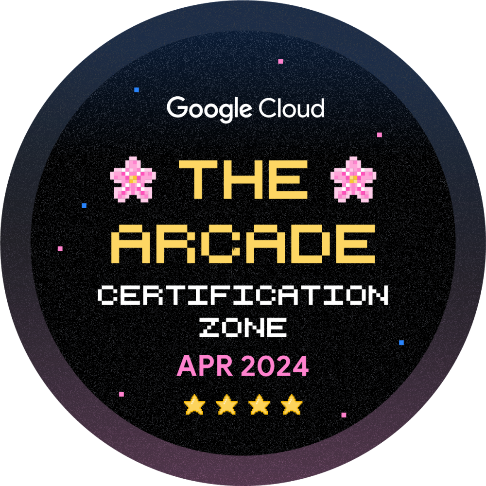
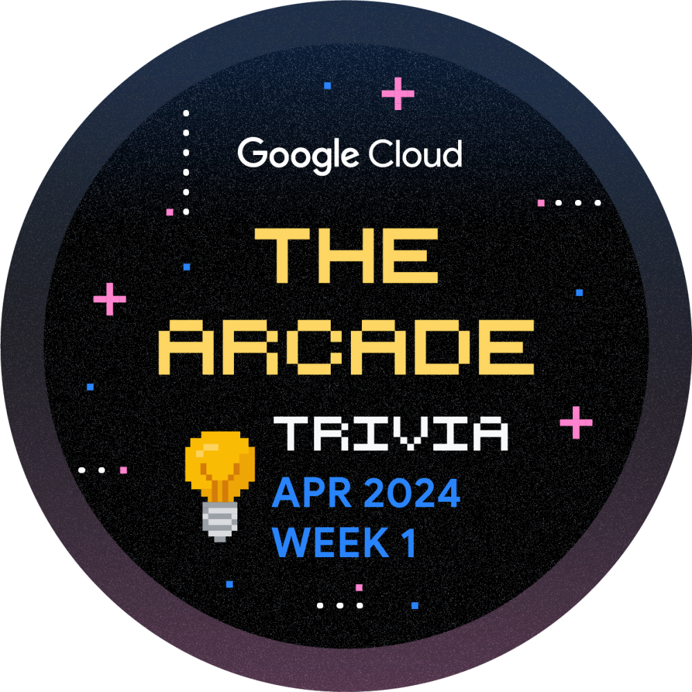
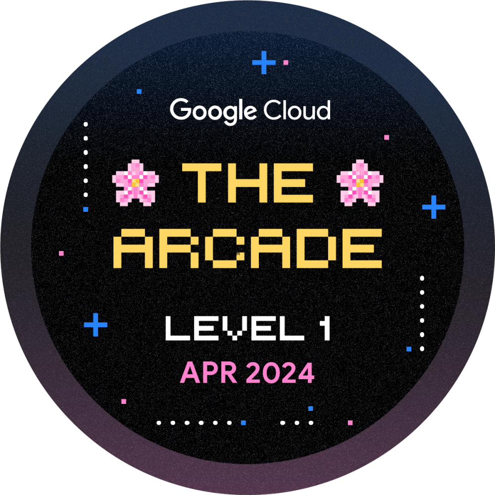
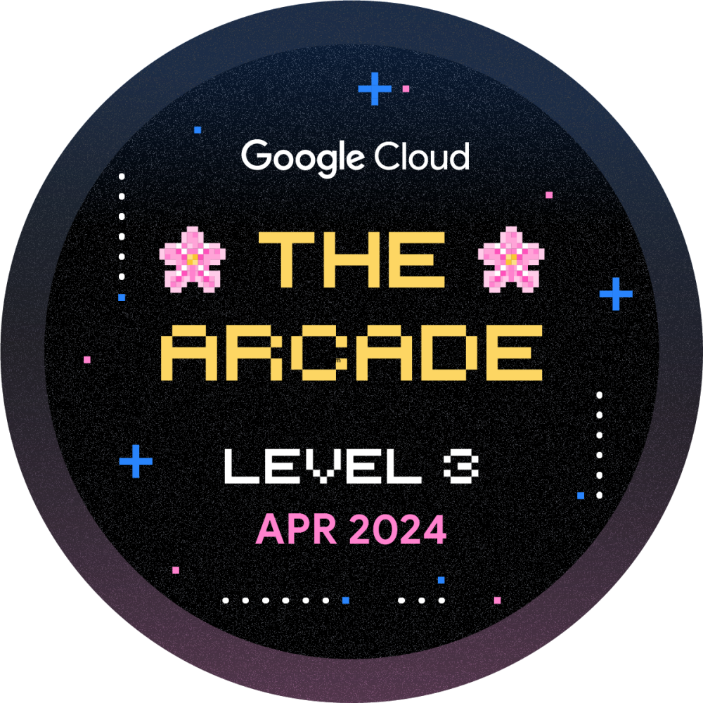
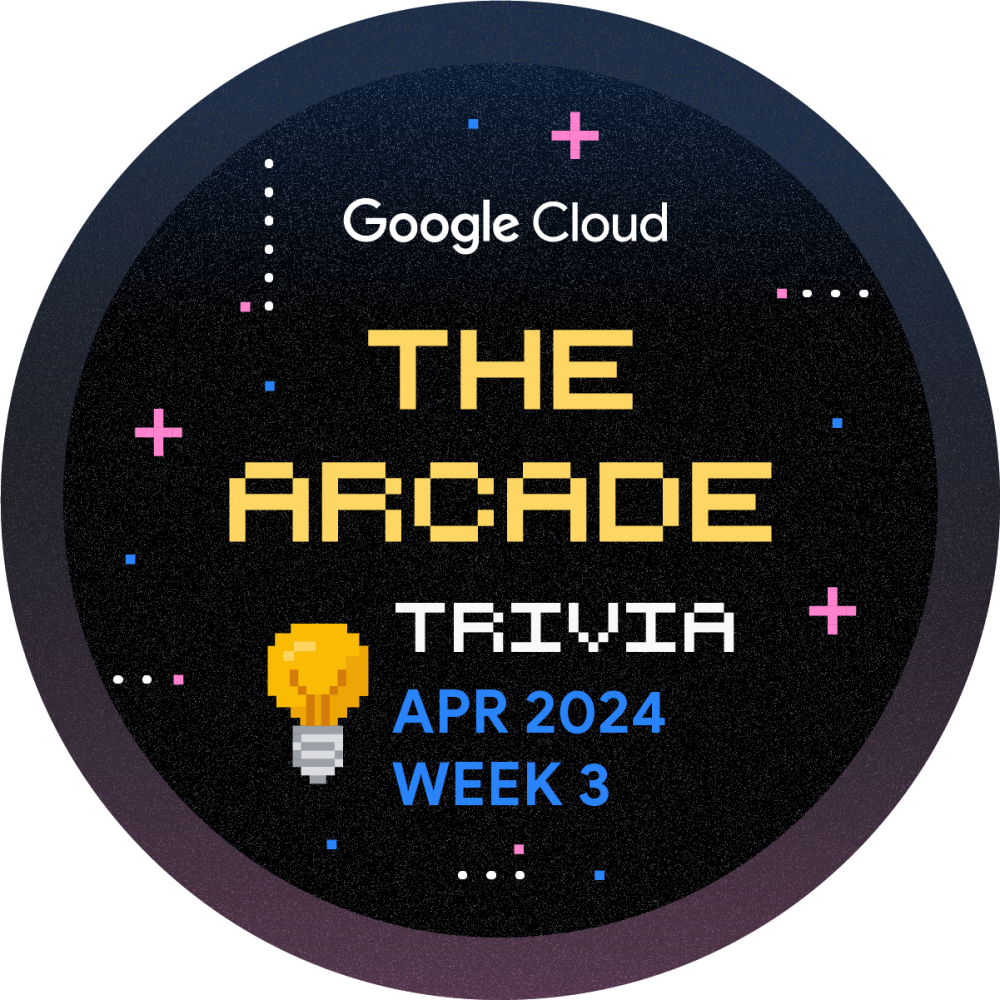
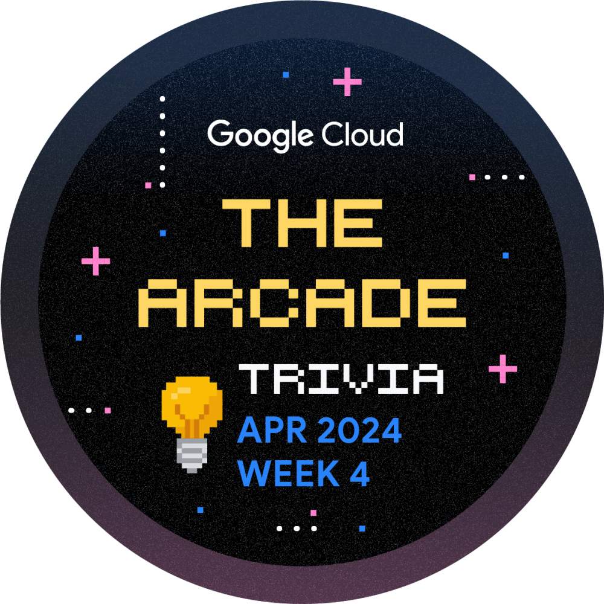

 
 <h2 align="left">Hi, I’m @daivik05</h2>

###
 Wubba Lubba Dub Dub

  
  

  

 <h2 align="center"><b>Socials</b></h2>

  
  
  

 <h2 align="center"><b>Skills </b></h2>

  
  
  
  
  
  
  
  
  

###
###

###

 
 

<!---
daivik05/daivik05 is a ✨ special ✨ repository because its `README.md` (this file) appears on your GitHub profile.
You can click the Preview link to take a look at your changes.
--->
<h3 align="center">
  
   <h2 align="center"><b>Google Cloud Skills Badges</b></h2>
</h3>

 
  
  
 
 
  
  
 
 

